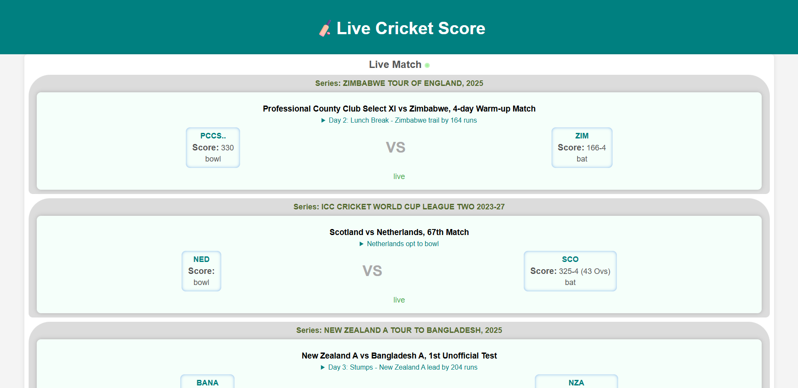

# 🏏 Live Cricket Score App

A fast, minimal frontend web app that displays **real-time cricket match scores**, upcoming fixtures, and recently concluded matches using data from public cricket APIs.

## 📸 Screenshot

## 🔗 Live Site

[Live Demo](https://live-cricket-score-five.vercel.app)

## 🚀 Features

- ✅ Live scores from international and league matches
- 📅 Upcoming match schedules (international)
- 🏁 Recently concluded match results
- 🔁 Auto-updating live scores (every 1 minute)
- ⚡ Server-side caching to reduce API calls
- 🔐 Rate limiting to prevent abuse
- 🌐 CORS protection to allow only trusted origins

## 🛠️ Tech Stack

### Frontend
- HTML, CSS, JavaScript (Vanilla)

### Backend
- Node.js with Express
- `node-fetch` for API requests
- `express-rate-limit` for IP-level request limits
- Caching mechanism using in-memory store

### APIs Used
- [Cricket Live Scores API](https://rapidapi.com/apidojo/api/unofficial-cricbuzz)
- [Cricket Free Data API](https://rapidapi.com/apidojo/api/cricket-api-free-data)

## 📦 API Proxy Server

To protect API keys and handle rate limiting, a custom Express proxy server is deployed. The server:

- Fetches and caches data:
  - Live scores: every 1 minute
  - Upcoming & recent matches: every 3 hours
- Serves only from cache regardless of user frequency
- Restricts each user to:
  - 1 `/api/live` request per minute
  - 8 `/api/upcoming` and `/api/recent` requests per day

## 🧪 How It Works

1. User opens the web app.
2. Frontend fetches from backend endpoints (`/api/live`, `/api/upcoming`, `/api/recent`).
3. Backend serves from cache, refreshing it only if needed.
4. API key is hidden from frontend for security.

## 🔒 Rate Limiting (per user/IP)

| Endpoint       | Limit             |
|----------------|-------------------|
| `/api/live`    | 1 request / minute |
| `/api/upcoming`| 8 requests / day   |
| `/api/recent`  | 8 requests / day   |

### 🧑‍💻 Author
Made with ❤️ by [Rayhan](https://github.com/rayhan5497)
